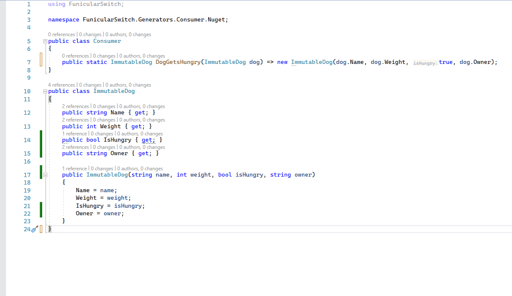

# Switchyard
Roslyn based refactorings for Visual Studio to support functional constructs in C# with less effort

Available at [Visual Studio Marketplace](https://marketplace.visualstudio.com/items?itemName=bluehands.Switchyard-Refactoring&ssr=false)

**HINT:** If you have *ReSharper* installed configure it to show or integrate VisualStudio quick actions. Settings can be found under Extensions->ReSharper->Options->Environment->Editor->Visual Studio Features->Visual Studio code analysis. Uncheck 'Hide Visual Studio Quick Action icons ...' or set the 'Merge Visual Studio Quick Actions ...' checkbox.

Refactorings interact nicely with the [FunicularSwitch.Generators](https://www.nuget.org/packages/FunicularSwitch.Generators) package. It automagically generates Match methods for your union types (they are no longer generated by Switchyard as soon as you install the analyzer), so this generated boilerplate code is no longer visible.

## Refactorings

### Expand enum to union type


**Motivation:** Imagine classes representing an ftp connection configuration like:

```csharp
public enum ConnectionType
{
  UserNameAndPassword,
  KeyFile
}

public class SFtpConfig
{
  public ConnectionType ConnectionType { get; }
  public string User { get; }
  public string Password { get; }
  public string PathToKeyFile { get; }

  public SFtpConfig(ConnectionType connectionType, string user, string password, string pathToKeyFile)
  {
    ConnectionType = connectionType;
    User = user;
    Password = password;
    PathToKeyFile = pathToKeyFile;
  }
}

/// ......

public class SFtpClient
{
  public void Connect(SFtpConfig config)
  {
    switch (config.ConnectionType)
    {
      case ConnectionType.UserNameAndPassword:
        ConnectWithPassword(config.User, config.Password);
        break;
      case ConnectionType.KeyFile:
        ConnectWithKeyFile(config.User, config.PathToKeyFile);
        break;
      default:
        throw new ArgumentOutOfRangeException();
    }
  }
  
  FtpConnection ConnectWithKeyFile(string argUser, string argKeyFilePath) => throw new NotImplementedException();

  FtpConnection ConnectWithPassword(string withPasswordUser, string withPasswordPassword) => throw new NotImplementedException();
}

```

With the config class implemented like that every consumer has to switch on the `ConnectionType` property and than guess which properties on SFtpConfig are relevant in his case. First problem here, the guess could be wrong and types of all 'eventual properties' on SFtpConfig have to allow empty or null values. Second problem is common to all enums: An extension of the enum won't be visible to consumers at compile time. So a third option introduced might lead to ArgumentOutOfRange exceptions at runtime.

One solution to the problem is so called union types or discriminated unions, basically types that can be one thing or an other. Those types are supported natively in F# an other functional languages. In C# they have to be implemented by hand, and that is where the refactoring comes in.

**Usage:** Start with an enum like that:

```csharp
public enum SFtpConfig
{
  Password,
  KeyFile
}
```

As soon as the cursor is inside of an enum declaration, refactoring 'Expand enum to union type' is offered, which will change the enum declaration to the following code (equality and internal members omitted):

```csharp
public abstract class SFtpConfig
{
  public static readonly SFtpConfig Password = new Password_();
  public static readonly SFtpConfig KeyFile = new KeyFile_();

  public class Password_ : SFtpConfig
  {
    public Password_() : base(UnionCases.Password)
    {
    }
  }

  public class KeyFile_ : SFtpConfig
  {
    public KeyFile_() : base(UnionCases.KeyFile)
    {
    }
  }
  
  // equality and internal members ....
}

// match helper ....

```

As you can see each enum case is now represented by a class derived from an abstract type named like the original enum. Static initializers are added to the base class for each case to allow comfortable construction of possible choices. One can add properties to the union case classes and intialize them from constructor parameters. Just run the refactoring again and static initializers will be adapted accordingly:

```csharp
public abstract class SFtpConfig
{
  public static SFtpConfig Password(string user, string password) => new Password_(user, password);
  public static SFtpConfig KeyFile(string user, string keyFilePath) => new KeyFile_(user, keyFilePath);

  public string User { get; }

  SFtpConfig(UnionCases unionCase, string user)
  {
    UnionCase = unionCase;
    User = user;
  }

  public class Password_ : SFtpConfig
  {
    public string Password { get; }

    public Password_(string user, string password) : base(UnionCases.Password, user) => Password = password;
  }

  public class KeyFile_ : SFtpConfig
  {
    public string KeyFilePath { get; }

    public KeyFile_(string user, string keyFilePath) : base(UnionCases.KeyFile, user) => KeyFilePath = keyFilePath;
  }
  
  internal enum UnionCases
  {
    Password,
    KeyFile
  }
  
  internal UnionCases UnionCase { get; }
  
  // equality and internal members ....
}

// match helper ....
```

All code added to the types is left untouched by the refactoring so it can be reapplied safely.

With that our SFtpClient can now be implemented in more 'type safe' manner:

```csharp
public class SFtpClient
{
  public FtpConnection Connect(SFtpConfig config)
  {
    return config.Match(
      withPassword => ConnectWithPassword(withPassword.User, withPassword.Password),
      withKeyFile => ConnectWithKeyFile(withKeyFile.User, withKeyFile.KeyFilePath)
    );
  }

  FtpConnection ConnectWithKeyFile(string user, string keyFilePath) => ...;

  FtpConnection ConnectWithPassword(string user, string password) => ...;
}
```

Users of your api are guided to correct usage by explicitly presented choices and types without eventual properties. If you ever add a third authentication method to your SFtpConfig union type all code consuming it will break at compile time.

To add a case to the union just add another entry to the UnionCases nested enum and reapply the refactoring.

### Generate 'With' extension



Generate an extension method for an immutable type to easly create copies of that type with specific properties changed. The extension is inspired by F#s with operator (and was built prior to introduction of records in C# ;)). For this to work you need an Option class (for example from [FunicluarSwitch](https://www.nuget.org/packages/FunicularSwitch/) package) and a construtor that initializes the objects (read only) properties:

```csharp
public class MyImmutableObject
{
    public int Number { get; }
    public bool IsActive { get; }
    public string Name { get; }

    public MyImmutableObject(int number, bool isActive, string name)
    {
        Number = number;
        IsActive = isActive;
        Name = name;
    }
}
```

Place the cusor somewhere inside the class an run the *Generate 'With' extension* refactoring. An extension class for your object is added:
```csharp
public static class MyImmutableObjectWithExtension
{
    public static MyImmutableObject With(this MyImmutableObject myImmutableObject, Option<int> number = null, Option<bool> isActive = null, Option<string> name = null) => 
        new MyImmutableObject(
            number: number != null ? number.Match(x => x, () => myImmutableObject.Number) : myImmutableObject.Number, 
            isActive: isActive != null ? isActive.Match(x => x, () => myImmutableObject.IsActive) : myImmutableObject.IsActive, 
            name: name != null ? name.Match(x => x, () => myImmutableObject.Name) : myImmutableObject.Name
        );
}
```

that can be used like that:

```csharp
var bruno = new MyImmutableObject(42, true, "Bruno");
var brunoInactivated = bruno.With(isActive: false);
```

If your type changes just rerun the refactoring and your extension will be replaced with the updated implementation.


### Generate state machine from dot file

Add a dot file containing a directed graph to a project and put a cs file named like the dot file next to it. In the cs file the 'Generate state machine from .dot' will show up. Executing it will produce classes representing the state machine. It's an immutable state machine, so firing a trigger on it will return the class representing the current state leaving the source instance untouched. Properties can be added to the Trigger classes and reapplying the refactoring will adapt corresponding method calls accordingly. Custom code in state and trigger classes is respected and will not be overriden, so the refactoring can be reapplied safely while extending the state machine.

... TODO: example


 
